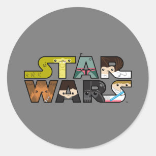

    

<h2 align="center"> https://star-wars-next-js-firebase.vercel.app </h2>

<h4 align="center">
    :construction: Proyecto en construcción :construction:
</h4>

## 🔎 Funcionalidades

 Se trata de un proyecto ⭐sobre STAR WARS, o la guerra de las Galaxias, dónde podrán ver sus personajes, planetas, películas, naves espaciales.

Los usuarios se podrán registrar e iniciar sesión, y podrán guardar sus personajes,  planetas, películas o naves espaciales favoritos

   

## 🛠️ Tecnologías
<table>
    <tr>
        <td align="center">
            
        </td>
        <td align="center">
            
        </td>
          <td align="center">
            
        </td>
        <td align="center">
            
        </td>
    </tr>
</table>

## 🧑‍💻 Developer
Realizado por <a href="https://www.linkedin.com/in/cecilia-perdomo/" style="text-decoration: none; color: inherit;">Cecilia Perdomo</a>, primera versión desde el 02 de Abril.

##
